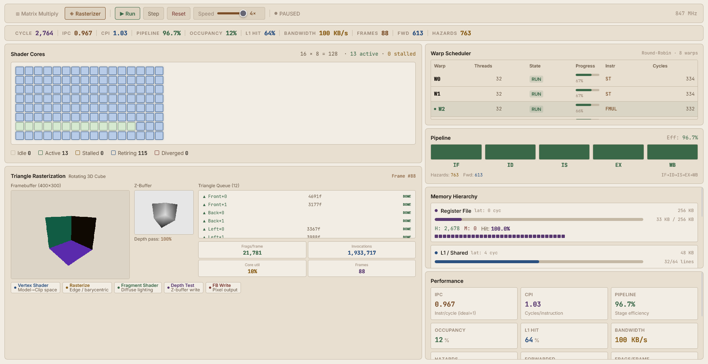

# VirtualGPU — Real-Time GPU Architecture Simulator

A browser-based simulator that visualises how a real GPU executes workloads in real time. Built as a CS361 Computer Architecture course project.



---

## What it simulates

### Hardware components
| Component | Details |
|---|---|
| **Shader Cores** | 128 cores in a 16 × 8 grid, colour-coded by state (idle / active / stalled / retiring / diverged) |
| **Warp Scheduler** | 8 warps × 32 threads, round-robin scheduling with live state tracking |
| **5-Stage Pipeline** | IF → ID → IS → EX → WB with forwarding path visualisation (RAW hazard detection) |
| **Register File** | 256 KB per SM, 32 register-bank lines visualised per-warp |
| **L1 / Shared Memory** | 48 KB, 64 cache lines, 4-cycle latency |
| **L2 Cache** | 4 MB, 128 cache lines, 12-cycle latency |
| **VRAM** | 8 GB global memory, 200-cycle latency, live bandwidth display |

### Workloads

#### Matrix Multiplication (`C = A × B`)
- Tiled execution: 4 × 4 thread blocks across 8 × 8 / 16 × 16 / 32 × 32 matrices
- Live tile progress (loading from VRAM → computing from L1 shared memory)
- Matrix A, B, C grids with cell values and colour-coded tile states
- TFLOPS counter

#### Triangle Rasterization (Rotating 3D Cube)
- Full software rasterization pipeline: vertex shader → barycentric scan → fragment shader → Z-buffer → framebuffer
- Double-buffered rendering (always displays a complete frame)
- Live Z-buffer depth heatmap
- Triangle queue showing each of the 12 triangles progress through the pipeline

---

## Architecture concepts demonstrated

| Concept | Where you see it |
|---|---|
| **CPU/GPU organisation** (ALU, CU, registers) | Shader core grid, register file panel |
| **Instruction Set Architecture** | Warp table instruction column (FMAD, LD, ST, SYNC, BRANCH …) |
| **Pipelining** | 5-stage pipeline bar with per-stage occupancy |
| **Hazards & Forwarding** | RAW hazard counter, forwarding event counter, "EX → IS bypass" label |
| **Cache memory hierarchy** | L1/L2/VRAM panels with hit/miss rates, fill bars, cache-line visualisation |
| **Warp scheduling** | Round-robin scheduler table, stall/diverge states, progress bars |
| **CPI / IPC** | Live CPI and IPC metrics; global memory storms drive CPI > 1.0 |

---

## Tech stack

- **Next.js 14** — App Router, client-side rendering
- **React** — hooks for all state management
- **Tailwind CSS** — utility-first styling
- **Zustand** — lightweight global state store
- **Inter + JetBrains Mono** — typography

All simulation logic runs in the browser (no backend).

---

## Getting started

```bash
# Install dependencies
npm install

# Run development server
npm run dev
# Open http://localhost:3000

# Production build
npm run build
```

---

## Controls

| Control | Action |
|---|---|
| **Run / Pause** | Start or freeze the simulation |
| **Step** | Advance exactly one clock cycle (when paused) |
| **Reset** | Clear all state and restart current workload |
| **Speed slider** | 0.25× to 4× simulation speed |
| **Matrix size** | 8 × 8, 16 × 16, or 32 × 32 (MatMul only) |
| **Workload tabs** | Switch between Matrix Multiply and Rasterizer |
| **Click a core** | Highlight that core and pin its tooltip |

---

## Project structure

```
/app
  page.js               — Main layout
  layout.js
  globals.css           — Light beige/brown theme, CSS variables
/components
  /gpu
    CoreGrid.jsx        — 128-core grid (16 × 8)
    CoreCell.jsx        — Individual core with hover tooltip
    WarpTable.jsx       — Warp scheduler panel
    PipelineBar.jsx     — IF → ID → IS → EX → WB stages + forwarding
    MemoryHierarchy.jsx — Registers / L1 / L2 / VRAM panels
    StatsPanel.jsx      — Live performance metric cards
  /workloads
    MatMulViz.jsx       — Matrix A, B, C grids with tile progress
    RasterizerViz.jsx   — Framebuffer canvas, Z-buffer, triangle queue
  /ui
    Controls.jsx        — Run / Pause / Step / Reset / Speed
    WorkloadTabs.jsx    — Workload switcher
/simulation
  gpu.js                — Central RAF loop, tick(), pub/sub
  matmul.js             — Tiled matrix multiply simulation
  rasterizer.js         — Software rasterizer (barycentric, Z-buffer, diffuse lighting)
  scheduler.js          — Round-robin warp scheduler
  memory.js             — Cache hierarchy simulation
/store
  gpuStore.js           — Zustand store (UI state)
```

---

## References

- NVIDIA GPU Architecture Whitepapers
- Patterson & Hennessy — *Computer Organization and Design*
- AMD GPU Profiler documentation
